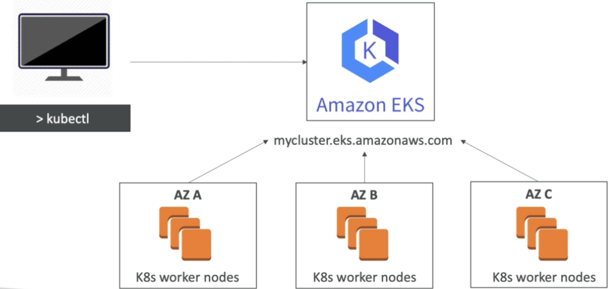

# K8sのおさらい

## マスター・ワーカーアーキテクチャ

マスターノード (またはControl Plane): 
- K8sクラスターの頭脳
- 冗長化・Security・Storage・スケーリングなど

ワーカーノード: 
- マスターノードの命令に従ってコンテナを起動・削除
- Metricsをマスターノードに送る
- コンテナのRuntimeがある

EKSの場合マスターノードはAWSでよしなに管理してくれるので、ワーカーノードを管理すれば良い。

## マスターノード (Control Plane)

- API server: kubectl CLIからのAPIリクエストを承認して、APIを実行
- Etcd: key-value を保存
- Controller: PodやDeploymentのヘルスチェックなどを行い、保持
- Scheduler: 新Podを作成し、Nodeに割り当てる

## ワーカーノード(Control Plane)

- kubelet
  - ワーカーノードに起動されているエージェントプロセス
- Container rumtime
  - Docker runtime
- Kubectl cli

