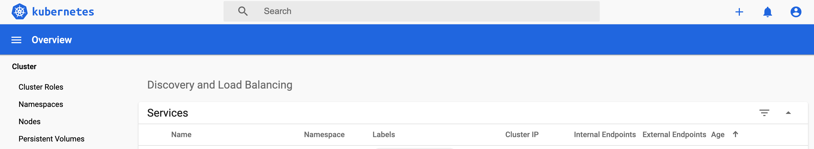

# ダッシュボードをインストール

メトリクスサーバーをインストール

```bash
# metricsサーバーをインストール
kubectl apply -f https://github.com/kubernetes-sigs/metrics-server/releases/download/v0.3.6/components.yaml
# 確認
kubectl get deployment metrics-server -n kube-system
```

ダッシュボードをインストール

```bash
kubectl apply -f https://raw.githubusercontent.com/kubernetes/dashboard/v2.0.0-beta8/aio/deploy/recommended.yaml
# ダッシュボードにログインするためのトークンを取得
kubectl describe secret $(kubectl get secret -n kubernetes-dashboard | grep kubernetes-dashboard-token | awk '{print $1}') -n kubernetes-dashboard
# ログイン
kubectl proxy
# URLでブラウザーからアクセス
http://localhost:8001/api/v1/namespaces/kubernetes-dashboard/services/https:kubernetes-dashboard:/proxy/
# さっきのtokenを貼り付けてログイン
```

ここまでで以下のようにログインできる



## RBACを使ってダッシュボードでMetricsをみるための必要なパミッションを追加

RBAC・・・Role Based Access Control

```yaml
apiVersion: v1
kind: ServiceAccount
metadata:
  name: eks-admin
  namespace: kube-system
---
apiVersion: rbac.authorization.k8s.io/v1beta1
kind: ClusterRoleBinding
metadata:
  name: eks-admin
roleRef:
  apiGroup: rbac.authorization.k8s.io
  kind: ClusterRole
  name: cluster-admin
subjects:
- kind: ServiceAccount
  name: eks-admin
  namespace: kube-system
```

```bash
kubectl apply -f eks-admin-service-account.yaml
# 確認
kubectl apply -f eks-admin-service-account.yaml
# eks-adminというサービスアカウントが作られている
# tokenの名前を確認
kubectl get sa eks-admin -n kube-system --output json | jq '.secrets[] | select(.name | contains("eks-admin-token")) | .name'  | pbcopy
# tokenを取得
kubectl -n kube-system describe secret "さっき取得したname"
# tokenをコピーして
echo "さっきコピーしたtoken" | base64 -d
```

このtokenを使って、ログインしなすことで `kube-system` とかのnamespaceも見れるようになっていく

